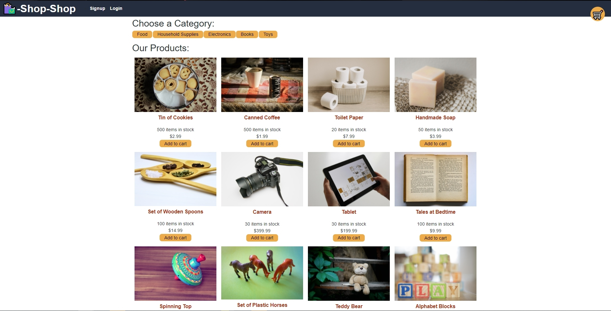

# shop-shop-redux
[See the app here]()  


## Description
This is a refactored version of the e-commerce shop-shop project, which uses Redux instead of context API to manage it's state.

* [Contribution](#Contribution)
* [Technologies](#Technologies-Used)
* [Contact](#Contact)

## User Story

```

AS a senior engineer working on an e-commerce platform
I WANT my platform to use Redux to manage global state instead of the Context API
SO THAT my website's state management is taken out of the React ecosystem

```

## Contribution
You can contribute to this project by making a pull request or sending me an email.


## Technologies Used
- MERN Stack
- Graphql
- Redux
- Stripe

## Contact
    Contact Me With Any Questions, Comments or Anything Else
https://github.com/grey-whitt

greywhitt@gmail.com


[License](https://www.contributor-covenant.org/)

Greyson Whittenberger 2020